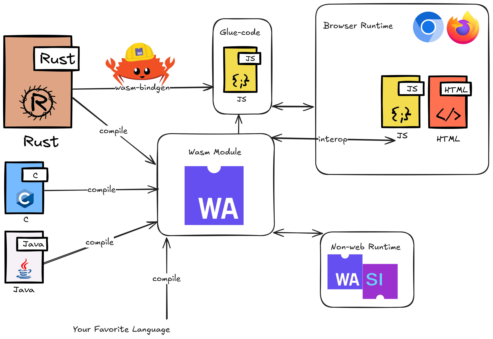

# CSC417 Language Project
## Sammy Shea

Implementation language:
- Rust: compiled, statically typed, general purpose language
    - No garbage collector (borrow checker)

Cool things:
- Custom parser, Wasm compilation (demo)

---

# Architecture Overview
- interpreter crate
	- `environment.rs`
	- `functions.rs`
	- `error.rs`
	- `interpreter.rs`
	- `lib.rs` and `main.rs`

---
## Expr
[interpreter.rs](interpreter/src/interpreter.rs)

- Language `Expr` type defined as an enumeration
- `Expr::eval` called recursively is the program
    - Matches on the `serde_json::Value` type

---

# WebAssembly (Wasm)

https://webassembly.org/

- WebAssembly is low level programming language that can be compiled to
	- Open web standard, included in all browsers
	- Faster than JavaScript

- Rust has great support for Wasm!
	- `wasm-bindgen` library and tooling like `wasm-pack`
    - https://rustwasm.github.io/
    - [What is Wasm?](https://rustwasm.github.io/docs/book/what-is-webassembly.html)

Demo: https://pages.github.ncsu.edu/sgshea/417-interp/
- Also includes my custom parser (not 1-1 compatible)

---

Questions